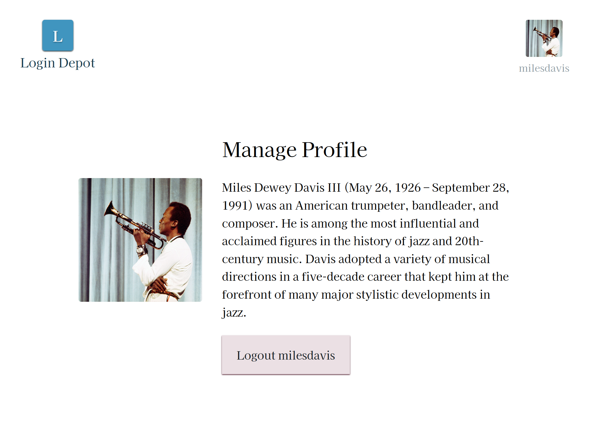

# Login Depot

Login Depot is an application that displays a login form when loaded and various details about the user after login. Right now, the logged in user is passed around through half a dozen different components. Your task is to refactor the application so that the user is kept in application state rather than being passed as a prop.

Logging in with the usernames `milesdavis` or `trane` with any password should result in a successful login.

## Rubric

* [ ] - Login with `milesdavis` or `trane` works
* [ ] - Logout works
* [ ] - User profile information displays in the `UserProfile` component
* [ ] - User profile information displays in the `ProfileControl` component
* [ ] - User information is accessed centrally
